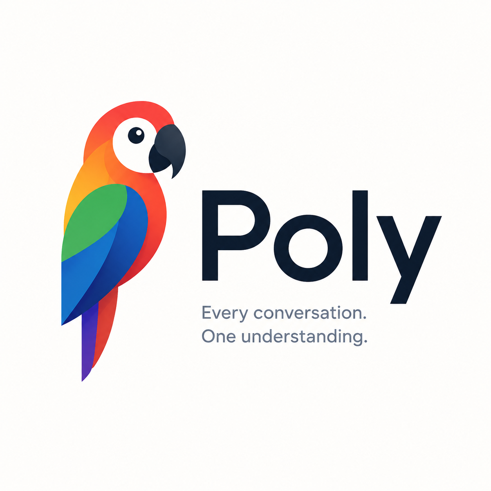
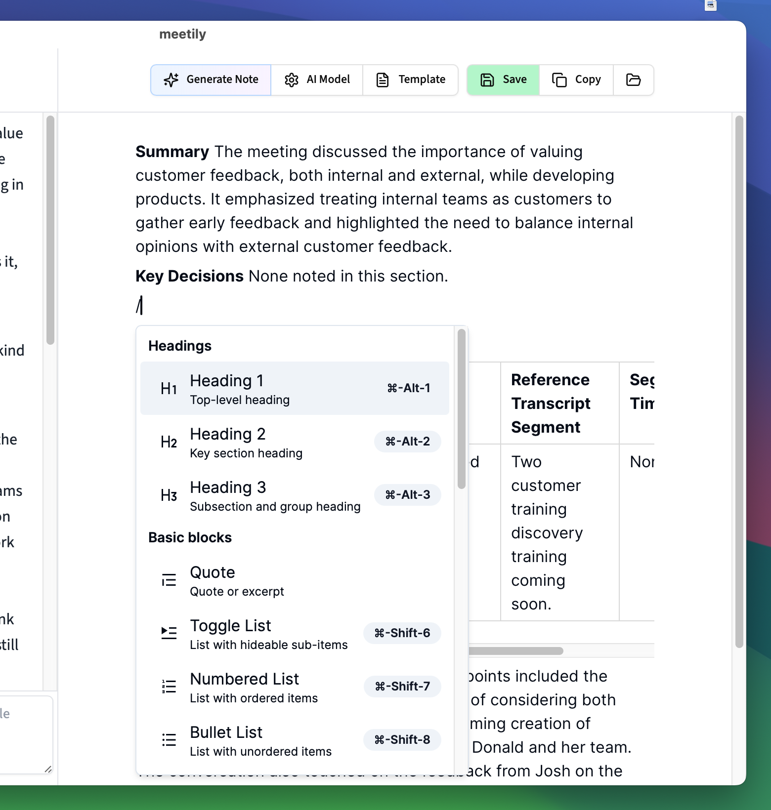
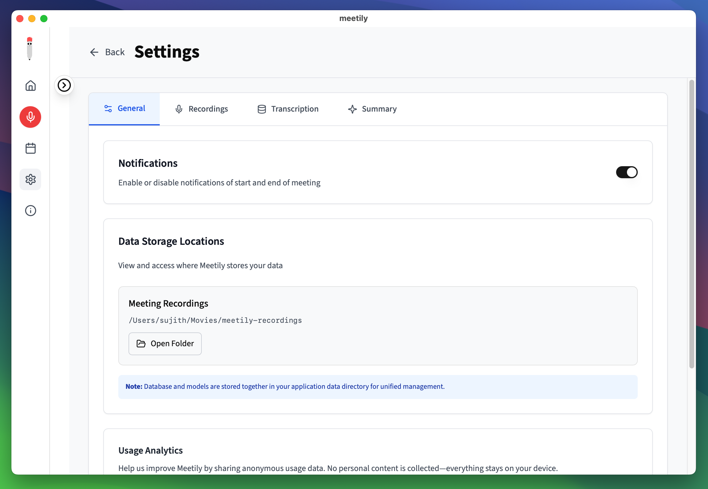
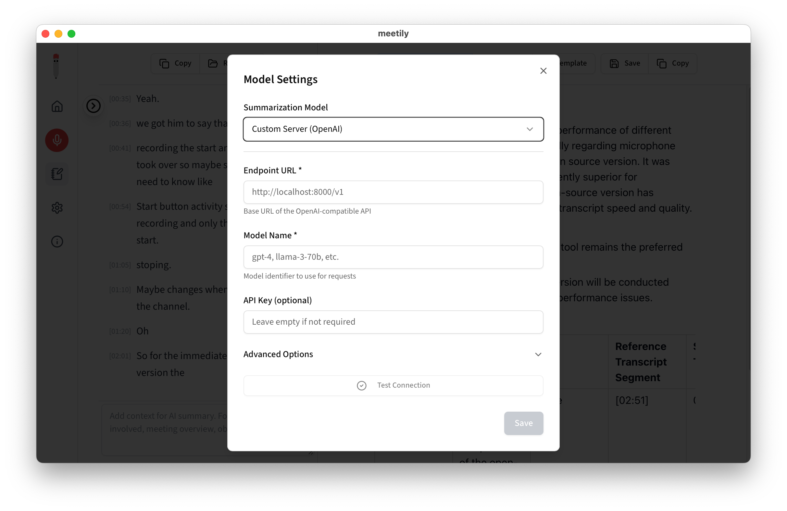
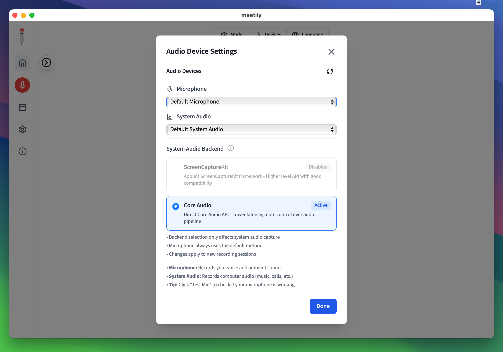

<div align="center" style="border-bottom: none">
    <h1>
        
        <br>
        Poly
    </h1>
    <h2>Privacy-First AI Meeting Assistant</h2>
    <a href="https://github.com/astra-hq/poly/releases"></a>
    <a href="https://github.com/astra-hq/poly"></a>
    <a href="https://github.com/astra-hq/poly"></a>
    <br>
    <h3>Open Source &middot; Privacy-First &middot; Local-First</h3>
    <p align="center">
    A privacy-first AI meeting assistant that captures, transcribes, and summarizes meetings entirely on your local machine. Built for data sovereignty — no cloud, no telemetry, no compromise on control.
    </p>
    <p align="center">
        
    </p>
</div>

---

<details>
<summary>Table of Contents</summary>

- [Introduction](#introduction)
- [Why Poly?](#why-poly)
- [Features](#features)
- [Installation](#installation)
- [Key Features in Action](#key-features-in-action)
- [System Architecture](#system-architecture)
- [For Developers](#for-developers)
- [Contributing](#contributing)
- [License](#license)

</details>

## Introduction

Poly is a privacy-first AI meeting assistant that runs entirely on your local machine. It captures your meetings, transcribes them in real-time, and generates summaries — all without sending any data to the cloud. This makes it the perfect solution for professionals and enterprises who need to maintain complete control over their sensitive information.

## Why Poly?

While there are many meeting transcription tools available, Poly stands out by offering:

- **Privacy First:** All processing happens locally on your device. No data ever leaves your computer.
- **Cost-Effective:** Uses open-source AI models instead of expensive cloud APIs.
- **Flexible:** Works offline and supports multiple meeting platforms.
- **Customizable:** Self-host and modify for your specific needs.

<details>
<summary>The Privacy Problem</summary>

Meeting AI tools create significant privacy and compliance risks across all sectors:

- **$4.4M average cost per data breach** (IBM 2024)
- **&euro;5.88 billion in GDPR fines** issued by 2025
- **400+ unlawful recording cases** filed in California this year

Whether you're a defense consultant, enterprise executive, legal professional, or healthcare provider, your sensitive discussions shouldn't live on servers you don't control. Cloud meeting tools promise convenience but deliver privacy nightmares with unclear data storage practices and potential unauthorized access.

**Poly solves this:** Complete data sovereignty on your infrastructure, zero vendor lock-in, and full control over your sensitive conversations.

</details>

## Features

- **Local First:** All processing is done on your machine. No data ever leaves your computer.
- **Real-time Transcription:** Get a live transcript of your meeting as it happens, powered by Parakeet models.
- **AI-Powered Summaries:** Generate meeting summaries using powerful language models.
- **Multi-Platform:** Runs on macOS and Linux.
- **Open Source:** Poly is open source and free to use under the MIT license.
- **Flexible AI Provider Support:** Choose from Local (on-device), Claude, Groq, OpenRouter, or use your own OpenAI-compatible endpoint. Ollama is available as an advanced external option.

## Installation

### 🍎 **macOS**

1. Download the latest `.dmg` from [Releases](https://github.com/astra-hq/poly/releases/latest)
2. Open the downloaded `.dmg` file
3. Drag **Poly** to your Applications folder
4. Open **Poly** from your Applications folder

### 🐧 **Linux**

Build from source following our detailed guides:

- [Building on Linux](docs/guides/building_in_linux.md)
- [General Build Instructions](docs/guides/BUILDING.md)

**Quick start:**

```bash
git clone https://github.com/astra-hq/poly
cd poly/frontend
pnpm install
./build-gpu.sh
```

## Key Features in Action

### 🎯 Local Transcription

Transcribe meetings entirely on your device using **Parakeet** models. You can also bring your own Hugging Face GGUF model for custom transcription. No cloud required.

<p align="center">
    
</p>

### 📥 Import & Enhance

Import existing audio files to generate transcripts, or enhance and re-transcribe any recorded meeting with a different model or language — all processed locally.

> Contributed by [Jeremi Joslin](https://github.com/jeremi), improved by [Vishnu P S](https://github.com/p-s-vishnu) and [Mohammed Safvan](https://github.com/mohammedsafvan)

<p align="center">
    
</p>

### 🤖 AI-Powered Summaries

Generate meeting summaries with your choice of AI provider. **Local** (on-device) is recommended, with support for Claude, Groq, OpenRouter, and OpenAI. Ollama is available as an advanced external option.

You can also connect to a local Knowledge Graph bridge (Docker + LightRAG + Neo4j) for meeting indexing and semantic search.

<p align="center">
    
</p>

<p align="center">
    
</p>

### 🔒 Privacy-First Design

All data stays on your machine. Transcription models, recordings, and transcripts are stored locally.

<p align="center">
    
</p>

### 🌐 Custom OpenAI Endpoint Support

Use your own OpenAI-compatible endpoint for AI summaries. Perfect for organizations with custom AI infrastructure or preferred providers.

<p align="center">
    
</p>

### 🎙️ Professional Audio Mixing

Capture microphone and system audio simultaneously with intelligent ducking and clipping prevention.

<p align="center">
    
</p>

### ⚡ GPU Acceleration

Built-in support for hardware acceleration across platforms:

- **macOS**: Apple Silicon (Metal) + CoreML
- **Linux**: NVIDIA (CUDA), AMD/Intel (Vulkan)

Automatically enabled at build time — no configuration needed.

## System Architecture

Poly is a single, self-contained desktop application built with [Tauri](https://tauri.app/). It uses a Rust backend to handle all core logic — audio capture, transcription, storage, and AI integration — paired with a Next.js frontend for the user interface. All processing happens on your machine; there is no separate cloud backend or API server required.

For more details, see the [Architecture documentation](docs/guides/architecture.md).

## For Developers

If you want to contribute to Poly or build it from source, you'll need Rust and Node.js installed. For detailed build instructions, see the [Building from Source guide](docs/guides/BUILDING.md).

## Contributing

We welcome contributions from the community. If you have questions or suggestions, please open an issue or submit a pull request. Follow the established project structure and guidelines. For more details, refer to the [CONTRIBUTING.md](CONTRIBUTING.md) file.

Thanks to all contributors — our community is what makes this project possible.

## License

MIT License — Feel free to use this project for your own purposes.

## Acknowledgments

- Some code adapted from [Whisper.cpp](https://github.com/ggerganov/whisper.cpp).
- Some code adapted from [Screenpipe](https://github.com/mediar-ai/screenpipe).
- Some code adapted from [transcribe-rs](https://crates.io/crates/transcribe-rs).
- Thanks to **NVIDIA** for developing the **Parakeet** model.
- Thanks to [istupakov](https://huggingface.co/istupakov/parakeet-tdt-0.6b-v3-onnx) for providing the **ONNX conversion** of the Parakeet model.

---

<sub>Poly is a community fork of the original Meetily open-source meeting assistant.</sub>
