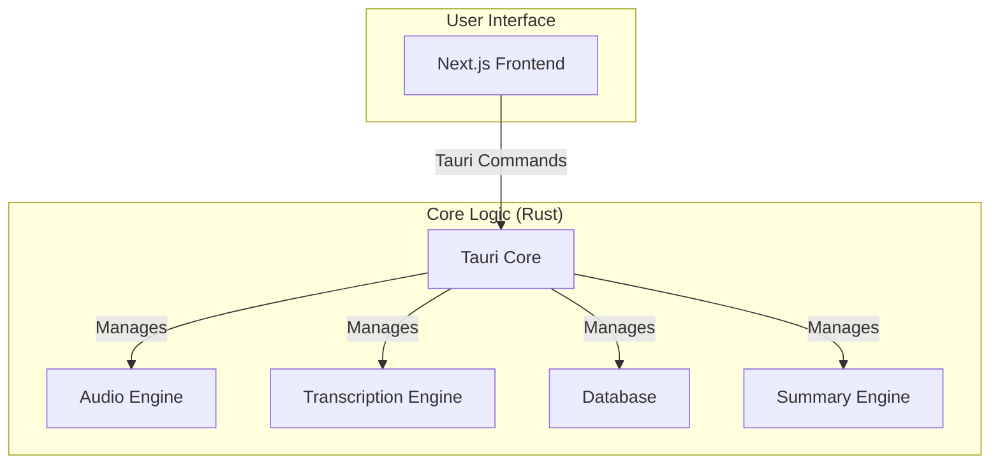

# System Architecture

Meetily is a self-contained desktop application built with [Tauri](https://tauri.app/). It combines a Rust-based backend with a Next.js frontend into a single, efficient, and cross-platform application.

## High-Level Architecture Diagram



## Component Details

### Frontend (Next.js)

*   Provides the user interface for managing meetings, displaying transcriptions, and configuring the application.
*   Communicates with the Rust core through Tauri's command system.

### Backend (Rust Core)

*   **Tauri Core:** The heart of the application, responsible for managing the window, handling events, and exposing the Rust core to the frontend.
*   **Audio Engine:** Captures audio from the microphone and system, processes it, and prepares it for transcription.
*   **Transcription Engine:** Uses local speech-to-text models (Whisper or Parakeet) to transcribe the captured audio. It can be accelerated with a GPU.
*   **Database:** A local SQLite database that stores runtime data only: meeting metadata, transcripts, summaries, and knowledge graph runtime state. Non-secret config is stored in `resourcefully.yml`; raw secrets (API keys) are stored in the OS keychain via `SecretStore`. Legacy `settings` and `transcript_settings` tables are dropped on first startup after migration — they are not active config stores.
*   **Summary Engine:** Generates meeting summaries using various Large Language Models (LLMs), including local models via Ollama.

## Config & Secret Storage Architecture

The app separates configuration, secrets, and runtime data into three distinct boundaries. No single store holds everything; each boundary has a single owner.

### Three Storage Boundaries

| Boundary | What it holds | Authoritative store | Location |
|---|---|---|---|
| **Non-secret config** | Providers, models, endpoints, preferences, KG profiles (NO API keys, NO secrets) | `resourcefully.yml` (YAML) | `~/.resourcefully/resourcefully.yml` |
| **Raw secrets** | API keys, tokens, credentials | `SecretStore` (keychain → file fallback) | macOS Keychain / file-based fallback |
| **Runtime data** | Meetings, transcripts, summaries, audio files, KG runtime state | SQLite | Tauri app data directory |

### How they interact

1. On startup, `ConfigRepository::load_or_create_default()` reads `resourcefully.yml` (or creates it with defaults on first run).
2. The caller merges secrets from `SecretStore` into the config struct **in memory** — raw secrets are never written to the YAML file.
3. SQLite stores only runtime artifacts (meeting records, transcript segments, summaries). On first startup after migration, legacy `settings` and `transcript_settings` tables are dropped.

### `resourcefully.yml` (non-secret config)

- **Path**: `~/.resourcefully/resourcefully.yml`
- **Format**: YAML, human-readable and version-control-friendly
- **Contents**: `SummaryConfig` (provider, model, whisper_model, ollama_endpoint), `TranscriptConfig` (provider, model), `PreferencesConfig` (language), `KnowledgeGraphSettings` (profiles without secrets)
- **API key fields are explicitly excluded** — `serde(default)` with `skip_serializing_if = "Option::is_none"` on `api_key` fields. The struct enforces this at the type level.
- **Atomic saves**: `ConfigRepository::save_atomic()` writes to a temp file, then renames. On failure, the existing file is preserved. A malformed YAML file produces a typed `serde_yaml` error — the app does not silently corrupt or truncate the file.
- **Troubleshooting malformed YAML**: If the app fails to load config, check `~/.resourcefully/resourcefully.yml` for syntax errors (indentation, unquoted colons in values). The error message includes line/column information. Delete the file to regenerate defaults on next launch.

### `SecretStore` (raw secrets)

- **Trait**: `SecretStore` with four methods: `get`, `set`, `delete`, `exists`
- **Primary implementation**: `KeyringFirstSecretStore` — tries the OS keychain first (macOS Keychain, Windows Credential Manager), falls back to an encrypted file store
- **Key format**: `SecretRef` enum — typed keys like `SecretRef::OpenAiApiKey`, not raw strings
- **Raw secrets never appear in YAML**. The config struct has `api_key` fields that default to `None` in serialization; the caller populates them from the `SecretStore` at the point of use.

### SQLite (runtime data only)

- Stores meetings, transcript segments, summaries, and knowledge graph runtime state
- The legacy `settings` and `transcript_settings` tables are **dropped on first startup after migration** — they are not part of the current schema
- References to `settings`/`transcript_settings` in code exist **only** in `legacy_extraction.rs` (migration path) and `database/setup.rs` (drop statements); they are not active config stores

### Docker env files (generated artifacts, not config)

- Files like `kg.env` are **generated runtime artifacts** written by the knowledge graph settings commands
- They are regenerated on every relevant config change — never edited by hand
- They are **not** a config source; the canonical config is always `resourcefully.yml` + `SecretStore`

### Config flow at a glance

```
┌──────────────────────┐     ┌──────────────────────┐
│  resourcefully.yml   │     │     SecretStore      │
│  (non-secret config) │     │  (API keys, tokens)  │
└──────────┬───────────┘     └──────────┬───────────┘
           │  load                      │  get
           ▼                            ▼
    ┌─────────────────────────────────────────┐
    │    In-memory merged config struct       │
    │  (SummaryConfig + TranscriptConfig      │
    │   + Preferences + KG profiles           │
    │   + resolved API keys from SecretStore) │
    └──────────────────┬──────────────────────┘
                       │ use
                       ▼
              ┌────────────────┐
              │  Business logic│
              │  (summary,     │
              │   transcription│
              │   KG commands) │
              └────────────────┘
```
